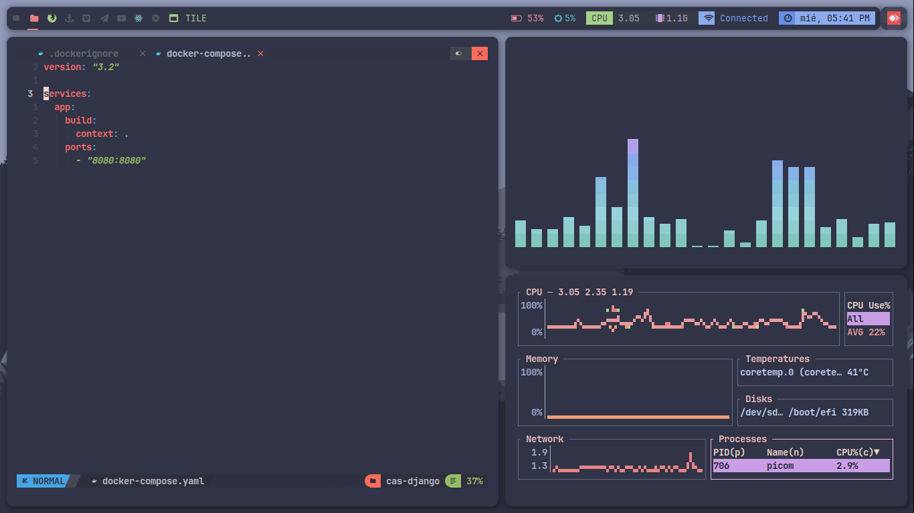

## Screens




## Install dwm
The following commands will clone a repository containing DWM configuration files and install DWM on your system:
```sh
cd ~
git clone https://github.com/juniorrumiche/dotfiles
cd dotfiles/dwm-source
sudo make install

sudo cp dwm.desktop  /usr/share/xsessions/
cd /usr/share/archcraft
sudo ln -s ~/dotfiles/dwm

```
## Install St Terminal
The following commands will clone a repository containing St configuration files and install St on your system:
```sh
cd ~/dotfiles/st
sudo make install
```
## For Picom

Picom is a lightweight compositor for X11. The following commands install Picom on your system:

```sh

paru -S uthash git 
git clone https://github.com/Arian8j2/picom-jonaburg-fix
git clone https://github.com/jonaburg/picom

cd picom
meson --buildtype=release . build
ninja -C build
sudo ninja -C build install

```


## Theme

The following commands install the Catppuccin theme for GTK and the lxappearance utility, which allows you to change the theme of your desktop environment:

```sh
paru -S catppuccin-gtk-theme-frappe lxappearance
cd ~/.config
ln -s ~/dotfiles/fish
ln -s ~/dotfiles/qt5ct
ln -s ~/dotfiles/Kvantum
ln -s ~/dotfiles/starship.toml
```

## Utils
The following commands install various utilities on your system:
```sh
paru -S fish starship google-chrome-stable neovim neovide gpick\
	
```
## Neovim Language Servers

Neovim is an extensible text editor. The following commands install various language servers for Neovim:

```sh
paru -S python-pyflakes python-black stylua python-lsp-server  python-virtualenv npm
```
